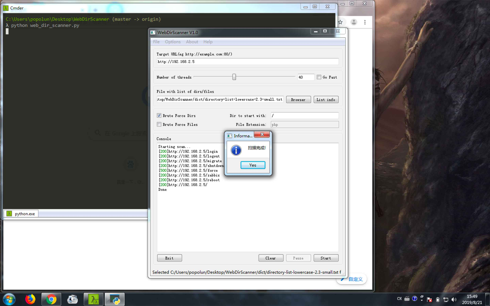

# WebDirScanner
Web敏感路径(dir)或敏感文件(file)扫描器-自用

WebDirScanner is a very small and simple tool by PyQt5 to find out sensitive web dir path or web static file. And WebDirScanner support cross-platform but unfortunately is that only running in Python3.

I built this program is that got inspiration from OWASP DirBuster tool. Because i thought DirBuster was not comfortable when i used. And one of the reason i created this program was i want to custom-built function by myself and the other one was i want to lean PyQt5. But out of any reasons, we all should pay our respect for the DirBuster authors.

## Feature
1. Providing GUI based on PyQt5
2. Cross-platform
3. Based on dictionary to crunch
	
	contain lots of powerful built-in dictionaries to crunch target website and also you can select the dictionary you gave.

4. Multithread

	support multithread based on ThreadPoolExecutor module.

## Installation
### Python2
```
git clone https://github.com/Lunpopo/GetWebBanner.git
cd GetWebBanner
pip2 install -r requirement.txt
python2 get_web_banner.py -h
```
### Python3
```
git clone https://github.com/Lunpopo/GetWebBanner.git
cd GetWebBanner
pip3 install -r requirement.txt
python3 get_web_banner.py -h
```

## Usage
It is very easy and simple to use this program when based on GUI, see below picture:



## Author
[Lunpopo](https://github.com/Lunpopo/get_web_banner)

You can modify and redistribute this script following GNU License and see alse or more details about GNU License to look through LICENSE file in this repository.

Most of others function is not explored still, so make do with it temporary. I am felling so sorry to that.

If you have good suggestion or good idea to improve this program, wellcome to contact me in Github, Thanks a lot.
